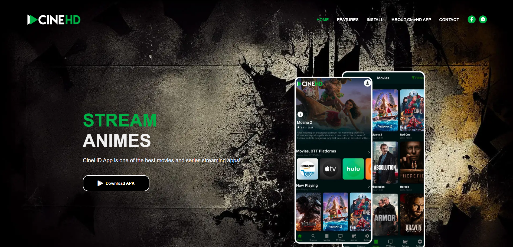

# CineHD.xyz

# **CineHD App - Android Streaming App**

Download Apk from the official website: [https://cinehd.xyz/download](https://cinehd.xyz/download)

---

## **What Is CineHD App?**
CineHD App is one of the best Android streaming apps available for movies, TV shows, and anime. It provides users with a seamless streaming experience, offering a wide range of content across various genres and languages. Whether you're a movie enthusiast, a binge-watcher, or an anime fan, CineHD has something for everyone.

---

## **Why Choose CineHD App?**

### • **User-Friendly Interface**
The CineHD app is designed with simplicity in mind, making it easy for anyone to navigate and find their favorite content without any hassle. The intuitive layout ensures a smooth and enjoyable browsing experience.

### • **Completely Ads-Free**
Unlike many other streaming apps, CineHD is completely free of ads, ensuring uninterrupted entertainment for its users.

### • **One-Click Play**
Enjoy instant access to your favorite movies and shows with the one-click play feature. No need to go through multiple steps—just tap and start watching.

### • **Watchlist**
Keep track of all the movies and TV shows you plan to watch. Add them to your personalized watchlist and access them anytime.

### • **History**
Never lose track of what you’ve watched. The history feature allows you to revisit your previously viewed content easily.

### • **Multiple Servers for Multiple Regions**
With multiple servers available, CineHD ensures smooth streaming for users across different regions, providing consistent and reliable performance.

---

## **Best Features**

- **Regular Updates**: Stay up-to-date with the latest movies, TV shows, and anime. New content is added regularly to keep you entertained.
- **HD Streaming**: Enjoy high-definition streaming quality for an immersive viewing experience.
- **Advanced Search and Filter Options**: Find your favorite content quickly with powerful search and filtering tools that let you sort by genre, year, language, and more.

---

## **How to Download and Install CineHD App**

1. **Download the APK**: Visit the official website [https://cinehd.xyz/download](https://cinehd.xyz/download) to get the latest APK version.
2. **Enable Unknown Sources**: On your Android device, go to Security settings and enable "Unknown Sources" to allow installation of third-party apps.
3. **Install and Launch**: Locate the downloaded APK file, tap on it, and click "Install." Once installed, open the app and start streaming.

---

## **Frequently Asked Questions**

### • **Is CineHD App safe to download and install?**
Yes, CineHD is safe to use as long as you download the APK from the official website.

### • **Does CineHD App support casting to Smart TVs?**
Yes, CineHD supports casting. You can use the cast option on your Android device to connect to your Smart TV.

### • **Is CineHD App free to access?**
Yes, the CineHD app is completely free to use with no hidden charges.

---

## **Final Thoughts**
CineHD App is the ultimate solution for anyone looking for a hassle-free streaming experience on Android devices. With its user-friendly interface, high-quality streaming, and a wide range of features, it stands out as one of the best choices for movie and TV show enthusiasts. Download CineHD today and take your entertainment to the next level!

